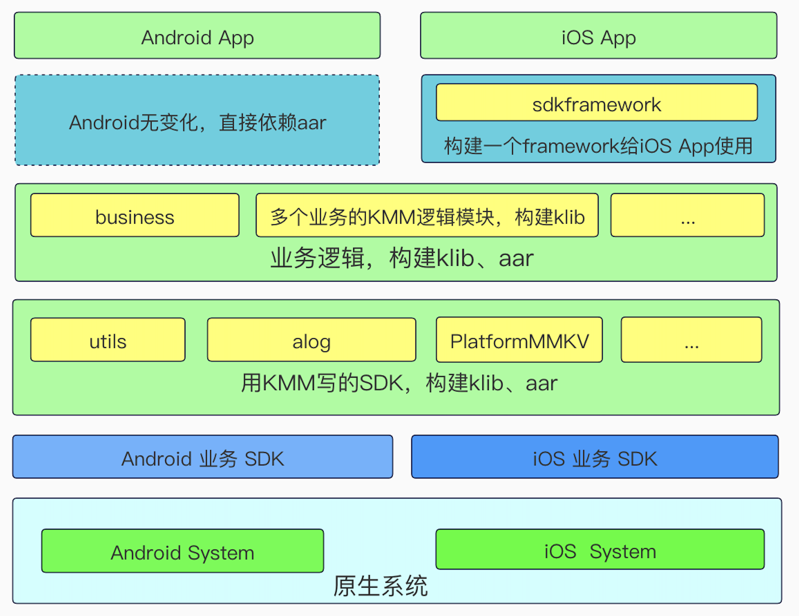

An app architecture for Kotlin/Native on Android/iOS. Use Kotlin Multiplatform Mobile.

项目架构主要分为原生系统层、Android/iOS业务SDK层、KMM SDK层、KMM业务逻辑SDK层、iOS sdkframework层、Android/iOS App层。

原生系统层：这里提下原生系统层的目的是，有些平台特性需要分开实现，比如读取文件、打印日志、摄像头等。

Android/iOS业务SDK层：主要是包括一些现有的Android/iOS SDK，需要直接依赖现有SDK来开发KMM时，在commonMain expect声明接口，在androidMain、iosMain actual分别依赖现有SDK实现。这样就可以使用已有的SDK，后续也可以保持接口不变，直接使用KMM实现SDK，如alog、PlatformMMKV。

KMM SDK层：如alog、PlatformMMKV写成一个SDK可以供其他KMM模块(business)使用。

KMM业务逻辑SDK层：具体业务的逻辑模块，比如登录逻辑、获取首页列表逻辑、查看首页列表数据详情等。

iOS sdkframework层：Kotlin/Native构建一个framework时，产物是二进制，也包含了Kotlin/Native的基础库、Runtime，会使包大小增加1M+左右，而且多个Kotlin/Native构建的framework不会共享基础库导致每一个framework都会增加1M+，为了避免包过大，统一构建一个framework。

App层：Android的依赖无变化，依赖aar或者jar；iOS依赖sdkframework，这样iOS包大小只增加1M+。当然如果依赖了一些库如ktor网络库，包也会变大，避免这个问题也可以不用依赖ktor，直接依赖现有的网络库来实现一个KMM SDK。

了解更多请查看[Kotlin/Native KMM项目架构](https://libill.github.io/2021/10/14/Kotlin-Native-KMM-app-architecture/)

参考链接：

1、[kmm-getting-started](https://kotlinlang.org/docs/kmm-getting-started.html)

2、[Multiplatform programming](https://kotlinlang.org/docs/multiplatform.html)

3、[KMM 求生日记二：Kotlin/Native 被踩中的坑](https://mp.weixin.qq.com/s/e3k5JcxG1FvGlNkOyjNIFw)

4、PlatformMMKV参考[KNDemo](https://github.com/River418/KNDemo)

其他：微信讨论群

